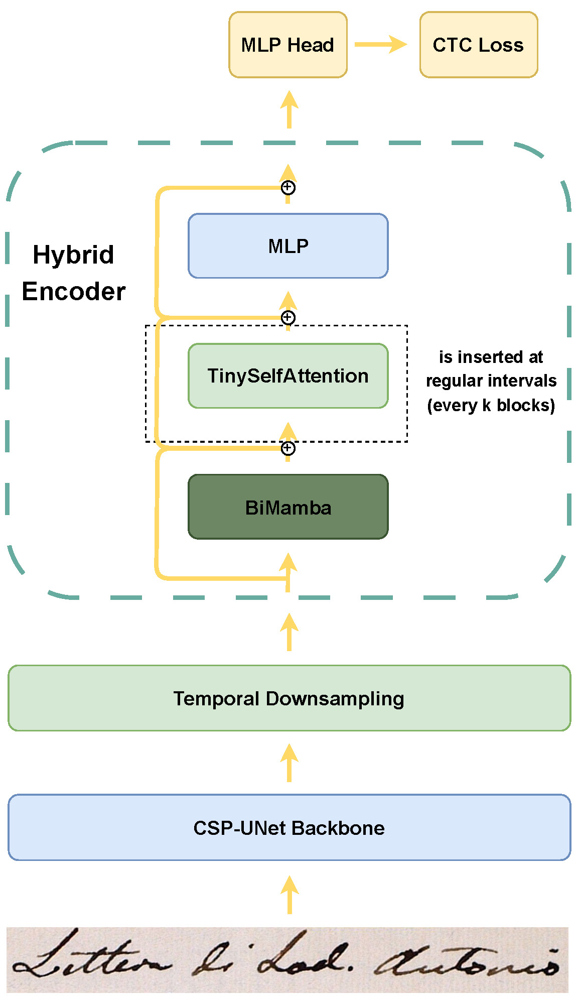
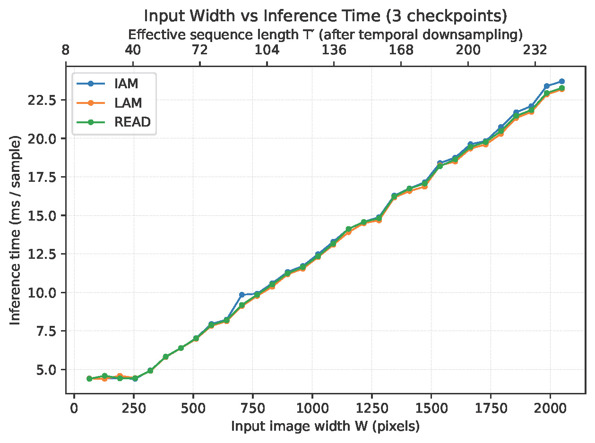
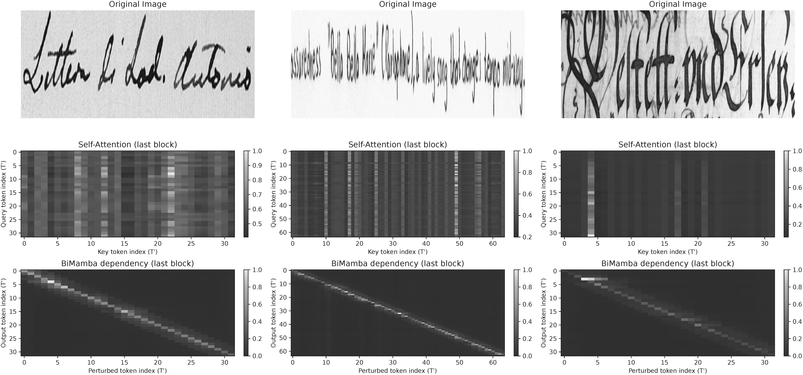

# 📘 HTR-HSS

Official implementation of our handwritten text recognition (HTR) framework:

**HTR-HSS: A Hybrid State-Space and Sparse Self-Attention Architecture for Offline Handwritten Text Recognition**

> This repository contains the PyTorch implementation, training / evaluation scripts, and visualization tools used in our experiments on IAM, READ2016, and LAM.

---

## Table of Contents

- [1. Introduction](#1-introduction)
- [2. Repository Structure](#2-repository-structure)
- [3. Environment](#3-environment)
- [4. Datasets](#4-datasets)
- [5. Quick Start](#5-quick-start)
  - [5.1 Training](#51-training)
  - [5.2 Testing](#52-testing)
  - [5.3 Prediction](#53-prediction)
- [6. Visualization](#6-visualization)
- [7. Checkpoints](#7-checkpoints)
- [8. Reproducibility Notes](#8-reproducibility-notes)
- [9. Acknowledgement](#9-acknowledgement)
- [10. Citation](#10-citation)

---

## 1. Introduction

Offline handwritten text recognition (HTR) requires models to simultaneously capture:

- **long-range contextual dependencies** across text lines, and
- **fine-grained local character details** for accurate transcription.

To address this challenge, we propose **HTR-HSS**, a lightweight hybrid architecture that combines:

- a **CSP-UNet-based visual backbone** for multi-scale feature extraction,
- a **temporal downsampling module** for reducing sequence length,
- and a **hybrid sequence encoder** composed primarily of **bidirectional Mamba (BiMamba)** blocks with **periodically inserted self-attention layers**.

This design aims to preserve the **linear-time sequence modeling capability** of state space models while retaining the ability of attention to improve **local alignment and feature refinement**.

## Overview

<p align="center">
  
</p>

### Main Characteristics

- End-to-end offline handwritten text recognition
- Trained **from scratch**
- **No pretraining**
- **No external language model**
- **No beam search during inference**
- Evaluated on:
  - **IAM**
  - **READ2016**
  - **LAM**

### Main Results

| Dataset  | CER (%) | WER (%) |
| -------- | ------: | ------: |
| IAM      |    4.60 |   14.91 |
| READ2016 |    3.80 |   16.96 |
| LAM      |    3.17 |    8.37 |

### Visual Results

<p align="center">
  
</p>

> **Note:** This repository is intended to support the reproducibility of the experiments reported in our paper.

---

## 2. Repository Structure

The project is organized as follows:

```bash
HTR-HSS/
│  predict.py
│  README.md
│  test.py
│  train.py
│  valid.py
│
├─data
│  │  dataset.py
│  │  format_datasets.py
│  │  transform.py
│  │
│  ├─iam
│  ├─LAM
│  └─read2016
│
├─model
│      backbone_csp_unet.py
│      htr_bimamba_hybrid.py
│
├─output
│  ├─IAM_A0_noAniso
│  │      best_CER.pth
│  │      best_WER.pth
│  │      events.out.tfevents...
│  │      run.log
│  │
│  ├─LAM_A0_noAniso
│  │      best_CER.pth
│  │      best_WER.pth
│  │      events.out.tfevents...
│  │      run.log
│  │
│  └─READ_A0_noAniso
│          best_CER.pth
│          best_WER.pth
│          events.out.tfevents...
│          run.log
│
├─run
│      iam_predict.sh
│      iam_test.sh
│      iam_train.sh
│      lam_predict.sh
│      lam_test.sh
│      lam_train.sh
│      read_predict.sh
│      read_test.sh
│      read_train.sh
│
├─utils
│      option.py
│      sam.py
│      utils.py
│
└─visualization
        bench_seq_len_time.py
        run_bench_seq_len_time.sh
        run_vis_attn_mamba_tokens.sh
        vis_attn_mamba_tokens.
```

### **Directory Description**

- **data/**
   Dataset files and dataset-related preprocessing / transformation code.

- model/

  Core model implementation, including:

  - `backbone_csp_unet.py`
  - `htr_bimamba_hybrid.py`

- **output/**
   Saved training outputs and checkpoints.

- **run/**
   Shell scripts for training, testing, and prediction on different datasets.

- **utils/**
   Utility modules such as argument parsing, optimizer wrapper, and helper functions.

- **visualization/**
   Scripts for efficiency analysis and qualitative visualization.

## 3. Environment

### 3.1 Tested Environment

All experiments in this work were conducted under a unified environment with the following configuration:

- **OS:** Ubuntu 24.04 LTS
- **Python:** 3.10
- **PyTorch:** 2.5
- **CUDA:** 12.1
- **GPU:** NVIDIA GeForce RTX 3090 (24 GB)

The state-space model components were implemented using:

- `mamba_ssm==2.2.3`
- `causal_conv1d==1.5.0.post8`

Unless otherwise specified, both training and inference were performed on a **single GPU**.

### 3.2 Minimal Recommended Requirements

This repository was developed in a research environment and contains only the **core dependencies** required to understand and run the main codebase.

```bash
torch==2.5.0
torchvision==0.20.0
torchaudio==2.5.0
numpy==1.26.4
Pillow==8.4.0
PyYAML==6.0.3
tqdm==4.67.1
matplotlib==3.8.4
scipy==1.15.2
pandas==2.3.3
editdistance==0.6.2
einops==0.8.1
timm==1.0.21
tensorboard==2.20.0
opencv-python==4.12.0.88
lmdb==0.9.31
mamba-ssm==2.2.3
causal-conv1d==1.5.0.post8
```

### 3.3 Installation

We recommend using **conda**:

```bash
conda create -n htr_hss python=3.10 -y
conda activate htr_hss
```

Then install the major dependencies manually:

```bash
pip install torch==2.5.0 torchvision==0.20.0 torchaudio==2.5.0
pip install numpy Pillow PyYAML tqdm matplotlib scipy pandas editdistance einops timm tensorboard opencv-python lmdb
pip install mamba-ssm==2.2.3 causal-conv1d==1.5.0.post8
```

> **Important:**
>  This repository was developed in a practical research environment rather than a fully minimal isolated environment.
>  As a result, depending on your local setup, you may need to manually install a few additional auxiliary packages.

------

## 4. Datasets

This work uses the following benchmark datasets:

- **IAM**
- **READ2016**
- **LAM**

### Dataset Availability

Due to licensing, hosting, and dataset access issues, **we do not directly redistribute the datasets in this repository**.

Please obtain the datasets from their **official or legally authorized sources**.

### Important Note

Some original download links may become unavailable over time.
 If a dataset link is no longer accessible, users may need to search for updated official mirrors, institutional archives, or community-maintained access points.

> We intentionally do **not** provide direct third-party redistribution links here in order to avoid possible copyright or licensing issues.

------

### Expected Folder Structure

Please organize the datasets under `./data/` as follows:

```bash
./data/
├── iam/
│   ├── train.ln
│   ├── val.ln
│   ├── test.ln
│   └── lines/
│       ├── xxx.png
│       ├── xxx.txt
│       └── ...
│
├── read2016/
│   └── ...
│
└── LAM/
    └── ...
```

------

## 5. Quick Start

We provide convenient shell scripts in `./run/` for training, testing, and prediction.

------

### 5.1 Training

#### IAM

```
bash run/iam_train.sh
```

#### LAM

```
bash run/lam_train.sh
```

#### READ2016

```
bash run/read_train.sh
```

------

### 5.2 Testing

#### IAM

```
bash run/iam_test.sh
```

#### LAM

```
bash run/lam_test.sh
```

#### READ2016

```
bash run/read_test.sh
```

------

### 5.3 Prediction

The `predict.py` script can be used to generate predictions for the full test set.

#### IAM

```
bash run/iam_predict.sh
```

#### LAM

```
bash run/lam_predict.sh
```

#### READ2016

```
bash run/read_predict.sh
```

------

## 6. Visualization

This repository also includes scripts for visual analysis and efficiency benchmarking.

### 6.1 Sequence Length vs Inference Time

```bash
bash visualization/run_bench_seq_len_time.sh
```

This script is used to evaluate the relationship between:

- input image width,
- effective sequence length after temporal downsampling,
- and inference latency.

A typical result is shown below:

<p align="center">
  
</p>

### 6.2 Attention / BiMamba Qualitative Visualization

```bash
bash visualization/run_vis_attn_mamba_tokens.sh
```

This script can be used to visualize:

- original input line images,
- self-attention maps,
- BiMamba dependency / response patterns.

A typical result is shown below:

<p align="center">
  
</p>

------

## 7. Checkpoints

- We provide selected pretrained checkpoints for convenience.

  | Dataset | Checkpoint |
  |--------|------------|
  | IAM | [Download](https://huggingface.co/ppgvlv/HTR-HSS-checkpoints) |
  | LAM | [Download](https://huggingface.co/ppgvlv/HTR-HSS-checkpoints) |
  | READ2016 | [Download](https://huggingface.co/ppgvlv/HTR-HSS-checkpoints) |

------

## 8. Reproducibility Notes

To improve reproducibility and fairness across datasets, all experiments were conducted under a controlled setting.

### Unified Training Configuration

- Training batch size: **32**
- Validation batch size: **8**
- Total training iterations: **100,000**
- Optimizer: **SAM**
- Random seed: **123**

### Dataset-Specific Setting

The only dataset-specific difference in our main experiments was the **temporal downsampling stride**:

- **IAM:** stride = 4
- **LAM:** stride = 8
- **READ2016:** stride = 8

### Inference Setting

- No beam search
- No external language model
- Same temporal downsampling strategy as used during training

------

## 9. Acknowledgement

This repository was developed as part of a research project for handwritten text recognition.

### Code Base Note

Parts of the **overall training / evaluation framework and engineering structure** were adapted from the publicly available implementation of **HTR-VT**:

- **HTR-VT: Handwritten Text Recognition with Vision Transformer**
- Repository: https://github.com/Intellindust-AI-Lab/HTR-VT

In particular, the following parts were influenced by or adapted from prior open-source implementations:

- overall project organization,
- training / evaluation script framework,
- some data processing and utility code.

The **core model implementation and the main method proposed in this work** were developed for this project.

We sincerely appreciate the authors of prior open-source HTR projects for making their code available to the community.

------

## 10. Citation

If you find this repository useful for your research, please consider citing our work:

```bibtex
@misc{TODO_HTR_HSS,
  title        = {HTR-HSS: A Hybrid State-Space and Sparse Self-Attention Architecture for Offline Handwritten Text Recognition},
  author       = {Yuan PAN,Mingshi Jia},
  year         = {2026},
  note         = {Manuscript in preparation}
}
```

------

## Contact

If you encounter issues related to training, testing, or reproduction, feel free to open an issue in this repository.

